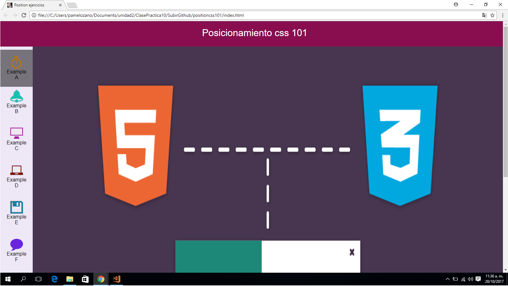
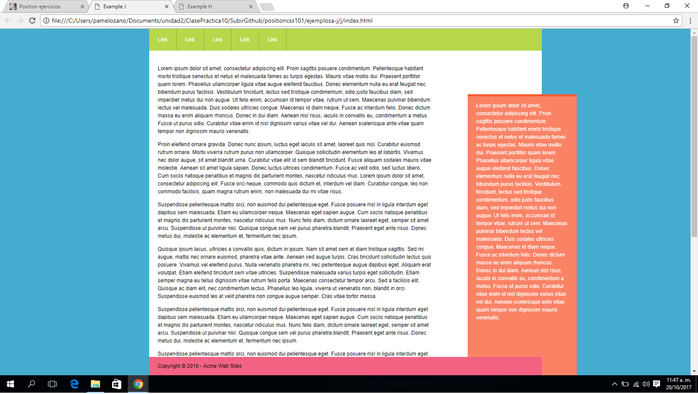

## POSICIONANDO CSS 101

### RESUMEN
Este repositorio contiene un proyecto llamado (Posicionando css 101), en este trabajado aplicamos lo aprendido en clase y self learning (iconos, tipografia, y uso de positioning) para poder alterar las posiciones de cada elemento.

### El proyecto esta compuesto por 2 partes:
   * MENU PRINCIPAL: (Contiene una barra lateral de iconos que te dirigen a cada ejercicio desde A - J)
   * Carpetas(ejemplosa-j): (contiene la estructura de cada ejercicio)

### Pondremos en práctica lo siguiente:
1. Aplicaremos **selectores:**
    * Selecto univeral: *
    * Selector elemento: div
    * Selector de clases: atributo **class**

2. Aplicaremos __"elementos que componen el modelo de caja"__
    * Padding **(relleno)**.
    * Margin **(margen)**

3. Aplicaremos la __"propiedad de los elementos de caja""__
    * display **(por bloques)**
    * background-color **(Color al bloque)**
    * width **(Ancho de la caja)**
    * height **(Alto de la caja)**

4. Aplicaremos __"Propiedad Positioning"__ definir que efectos realizar.
    * absolute **(para poder definir su posicion segun la estructura del HTML)**
    * relative **(para poder superponer a otros elementos)**

5. Aplicaremos __*Propiedades de position absolute*__ para posicionar las cajas.
    * top   **(parte superior)**
    * left  **(parte izquierda)**
    * bottom **(parte inferior)**

6. Aplicaremos __**Iconos**___ (NUEVO*)
    * Descargamos iconos de ICONMOON
    * Utilizamos elementos, atributos y valores para poder darle forma y sombreado a la hora que el cursor pase por encima del icono.

### Herramientas Utilizadas:
1. HTML
2. CSS3

### Imagen final:

### INSTRUCCIONES
**1°** Para poder dirigirnos a los ejercicios accedemos al MENU PRINCIPAL Y SELECCIONAMOS UN EJEMPLO de la barra lateral (desde la A-J)

**2°** Al pulsar click sobre la letra de cada icono, se abrira en otra pestaña nuestro ejemplo selecciona.

